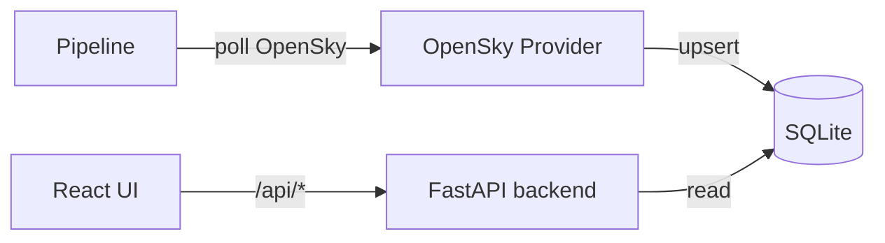
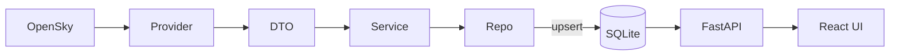

# FlightTracker

[](https://github.com/PriyanjanMitra/FlightTracker/actions/workflows/ci.yml)
[](https://opensource.org/licenses/MIT)
[](https://www.python.org/)
[](https://www.typescriptlang.org/)
[](https://github.com/astral-sh/ruff)
[](https://docs.pytest.org/)

Live flight tracking dashboard. An ingestion pipeline pulls aircraft state
vectors from the [OpenSky Network](https://opensky-network.org), stores them in
SQLite, and serves them to a React + Leaflet map UI.

## Table of contents

- [Features](#features)
- [Architecture](#architecture)
- [How the code works](#how-the-code-works)
- [Quick start](#quick-start)
- [Configuration](#configuration)
- [Commands](#commands)
- [Development](#development)
- [API](#api)
- [License](#license)

## Features

- **Live map** — dark-themed Leaflet map with aircraft markers colored by altitude
- **Aircraft list** — sortable, filterable sidebar with climb/descend status badges
- **Flight detail** — click any aircraft to isolate it, view its trail, and see
  altitude, speed, heading, vertical speed, and origin/destination

## Architecture



## How the code works

### Backend (`src/flight_tracker/`)

The backend is a Python package with four layers:
**CLI → controller → service/repository → provider**, all wired together with
dependency injection.

#### CLI entry point — `main.py`

`main.py` is an `argparse` CLI with five subcommands:

- `init-db` — creates the SQLite schema
- `load-ref-data` — imports OpenFlights reference data (airports, airlines,
  routes) used later for flight enrichment
- `ingest-once` — performs a single OpenSky fetch, useful for debugging
- `run-pipeline` — starts the periodic ingestion scheduler
- `serve-backend` — launches the FastAPI server

`run-pipeline` installs `SIGINT`/`SIGTERM` handlers so `Ctrl+C` cleanly shuts
down the scheduler instead of killing the process mid-write.

#### Configuration — `config.py`

A Pydantic `Settings` class reads environment variables (from `.env`) and
exposes them as typed attributes: `OPENSKY_BBOX`, `OPENSKY_POLL_SECONDS`,
`OPENSKY_USERNAME`/`OPENSKY_PASSWORD`, `DATABASE_URL`, and `LOG_LEVEL`.

#### Scheduler — `pipeline.py`

Builds an APScheduler `BackgroundScheduler` with two interval jobs:

- **`ingest_states`** — calls `IngestionController.handle_tick()` every
  `opensky_poll_seconds`
- **`prune_states`** — hourly, deletes `flight_states` rows older than 24 hours
  to keep the database bounded

#### Controller — `controllers/ingestion_controller.py`

Created with a SQLAlchemy `session_factory`. On each tick it opens a fresh
session (so a failure in one tick never leaks state into the next), constructs
the repository and service, and runs a single ingestion pass.

#### Service — `services/ingestion_service.py`

`run_once()` calls `provider.fetch_states(bbox)`, converts each returned
`FlightStateDTO` into a dict, and hands it to the repository's `upsert_many`.

#### OpenSky provider — `providers/opensky_provider.py`

The only component that talks to the network. Key behaviours:

- **Credentials** — `_load_auth()` reads `credentials.json` from the project
  root first (accepting either `username`/`password` or
  `clientId`/`clientSecret`), falling back to the env vars, and passes the pair
  as HTTP Basic auth to qualify for the 4000 req/h authenticated tier.
- **Rate limiting** — on HTTP 429 it reads
  `x-rate-limit-retry-after-seconds` from the response headers, stores
  `_rate_limit_until`, and returns an empty list. Subsequent ticks skip the
  request until the cooldown passes.
- **Retries** — transient `ConnectionError`/`Timeout` are retried up to 3 times
  with exponential backoff.
- **Parsing** — `_parse_states()` maps OpenSky's array-of-arrays payload (each
  row indexed by position) onto the typed `FlightStateDTO`.

#### Reference data provider — `providers/openflights_provider.py`

Parses the OpenFlights CSV datasets into typed models for airports, airlines,
and routes, cached under `data/openflights/` to avoid re-downloading.

#### ORM models — `models/orm.py`

SQLAlchemy models: `Airport`, `Airline`, `Route`, and `FlightState`.
`create_engine_safe()` enables SQLite **WAL mode** and a busy timeout so the
pipeline writer and the API readers can operate concurrently. `init_db()`
deduplicates existing rows and creates the composite indexes on older databases.

#### Repository — `repository/flight_state_repo.py`

Encapsulates every database query:

- `upsert_many` — a bulk SQLite `INSERT ... ON CONFLICT DO UPDATE` keyed on
  `(icao24, last_contact)`, so re-polling an aircraft updates its row instead
  of duplicating it.
- `latest_states` — returns one row per aircraft by joining against a subquery
  of the max `fetched_at` per `icao24`.
- `states_in_window` — fetches position history within a time range, powering
  the trail lines.

#### API — `api.py`

FastAPI app with three endpoints:

- `GET /api/states` — latest aircraft; results are cached for 2 seconds to
  absorb the frontend's polling. Rows without coordinates are filtered out.
- `GET /api/trails` — returns per-aircraft position history in a window.
- `GET /api/flight-info` — the smart endpoint. It resolves the callsign's
  airline code, loads that airline's routes from the reference data, computes
  each route's great-circle bearing and the aircraft's distance to both
  endpoints, then scores candidates. Phase matters: a climbing aircraft is
  assumed near its origin, a descending one near its destination.

### Frontend (`dashboard/src/`)

- **`api.ts`** — Axios client, typed responses, and all backend calls.
- **`App.tsx`** — Root component. Owns `states` (all aircraft) and `selected`
  (the chosen `icao24`), polls every 2 seconds, and composes the map, sidebar,
  trail layer, and detail panel. `MapFlyTo` only re-flies the map when the
  selected aircraft *changes* (not on every position tick); `MapClickHandler`
  deselects when clicking the map background.
- **`AircraftMarkers.tsx`** — Renders one Leaflet marker per aircraft. Icon
  colour encodes altitude (green → red gradient); heading is quantized to 5°
  steps so icons are reused instead of recreated every poll. Selecting an
  aircraft hides the rest and shows a larger highlighted marker.
- **`Sidebar.tsx`** — Dark-themed, sortable/filterable table with climb /
  descend / level status badges and live counts.
- **`SelectionDetail.tsx`** — Bottom slide-up panel shown for the selected
  aircraft: callsign, origin → destination, a telemetry grid, and metadata.
- **`TrailLayer.tsx`** — Fetches and draws the selected aircraft's position
  history as a polyline.

### Data flow



## Quick start

```bash
./run.sh
```

This installs dependencies, initializes the database, loads reference data
(airports, airlines, routes) on first run, and launches:

| Service    | URL                       |
| ---------- | ------------------------- |
| Dashboard  | http://localhost:5173     |
| API        | http://localhost:8000     |
| Docs       | http://localhost:8000/docs |

Press `Ctrl+C` to stop all services.

## Configuration

Copy `.env.example` to `.env` and adjust:

| Variable                 | Default                             | Description                             |
| ------------------------ | ----------------------------------- | --------------------------------------- |
| `OPENSKY_BBOX`           | *(empty)*                           | `lat_min,lat_max,lng_min,lng_max`; empty = worldwide |
| `OPENSKY_POLL_SECONDS`   | `1`                                 | Ingestion poll interval                 |
| `OPENSKY_USERNAME` / `OPENSKY_PASSWORD` | *(empty)*               | Authenticated OpenSky access (4000 req/h) |
| `AIRCRAFT_REGISTRY_DB` | `data/aircraft_registry.db` | Local icao24→typecode index for offline type lookup |
| `DATABASE_URL`           | `sqlite:///data/flight_tracker.db`   | SQLAlchemy connection string            |
| `LOG_LEVEL`              | `INFO`                              | Logging level                           |

### Authenticated OpenSky access

Anonymous access is limited to ~10 requests/min. To raise the limit to
4000 req/h, register at [opensky-network.org](https://opensky-network.org) and
add a `credentials.json` in the project root:

```json
{
  "username": "your@email.com",
  "password": "your-password"
}
```

Both `username`/`password` and `clientId`/`clientSecret` key pairs are
recognized. **This file is git-ignored — never commit it.**

Authenticated access also enables **trajectory-based route estimation**
(`/api/flights/aircraft`): origin/destination are inferred from the aircraft's
observed flight path when no filed route exists (the fallback after adsbdb and
the OpenSky routes API).

### Aircraft registry (offline type lookup)

Aircraft type details (typecode, model, registration, operator) come primarily
from a local SQLite index built from OpenSky's public aircraft database, so no
network call is needed per flight. Build it once:

```bash
# Download the latest snapshot from:
# https://s3.opensky-network.org/data-samples/metadata/aircraft-database-complete-*.csv
python scripts/build_aircraft_index.py aircraft-database-complete-2025-08.csv data/aircraft_registry.db
```

## Commands

```bash
python main.py init-db          # create database schema
python main.py load-ref-data    # load airports/airlines/routes
python main.py run-pipeline     # start the OpenSky ingestion loop
python main.py serve-backend    # start the FastAPI server
```

## Development

```bash
pip install -e ".[dev]"   # dev dependencies (ruff, mypy, pytest)
ruff check src/ tests/    # lint
mypy src/                 # type check
pytest                    # run tests
```

## API

| Endpoint                              | Description                         |
| ------------------------------------- | ----------------------------------- |
| `GET /api/states?limit=5000`          | Latest aircraft states              |
| `GET /api/trails?minutes=15`          | Recent trail points per aircraft    |
| `GET /api/flight-info?callsign=...`   | Enriched route/airport info for a flight |

## License

MIT
